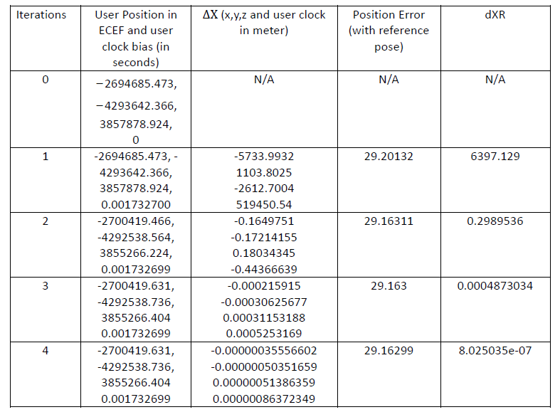
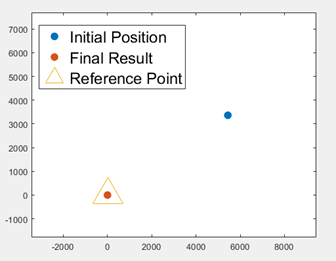
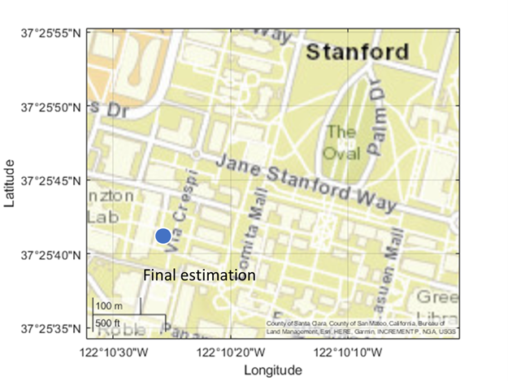

# Assignment for AAE6102 Satellite Communication and Navigation
This repository is the code for assignment of AAE6012 Satellite Communication and Navigation

## System Requirement
Tested on MATLAB R2021a (Windows 10)

## Run
- Download the package or git clone the repo.
- Open file [calculate_LS.m](calculate_LS.m) in MATLAB
- Run the code directly

## Results
- The satellites position in ECEF

| PRN |  X(m)              |  Y(m)              | Z(m)               | satellite clock (offset) |
| --- | ------------------ | ------------------ | ------------------ | ------------------------ |
| 5   | \-8855585.74989405 | \-22060118.8184291 | \-11922096.6034832 | 0.00018906574            |
| 6   | \-8087223.70092341 | \-16945968.4264429 | 18816191.7549327   | \-0.00000008393          |
| 10  | 9027652.46453491   | \-12319227.3219714 | 21737388.2917146   | 0.000033247628           |
| 17  | \-21277116.7987596 | \-7467121.88845831 | 14287508.1869361   | \-0.00020490264          |
| 22  | \-13649530.4402453 | 8229505.31591360   | 21122957.9604622   | 0.00022267809            |
| 23  | \-19452317.9777088 | \-16750380.0772894 | \-6918515.43477421 | 0.00001036021            |
| 26  | 6162914.23508139   | \-25286774.3085321 | \-3541185.66549688 | 0.00028099317            |
| 30  | \-17713895.8571847 | \-19797468.9488490 | 19203.6499798730   | \-0.000010041132         |


- The iteration position
<p align="center">
  
</p>

- User position of initial position, final result and reference point in ENU coordinate, respectively
<p align="center">
  
</p>
- User position of the final result in WGS84 on map
<p align="center">
  
</p>

## Function Details
```
function [XS, dtS] = sat_position(t, pseudorange, eph)
% INPUT:
%   t =  reception time
%   pseudorange = observed pseudoranges
%   Eph = ephemerides matrix
% OUTPUT:
%   XS      = satellite position at transmission time in ECEF(time_rx) (X,Y,Z)
%   dtS     = satellite clock error (vector)
%
% DESCRIPTION:
%   Computation of the satellite positions based on reception time.

function [Ek, n] = ecc_anomaly(time, Eph)
% INPUT:
%   time = GPS time
%   Eph = ephemerides matrix
% OUTPUT:
%   Ek = eccentric anomaly
%   n = corrected mean motion [rad/sec]
%
% DESCRIPTION:
%   Computation of the eccentric anomaly.


function [XR, dtR, sigma_XR] = LS_code(XR_approx, XS, pr_R,dtS, dtR, err_tropo_RS)
% INPUT:
%   el = satellite elevation
%   h  = receiver ellipsoidal height
%
% OUTPUT:
%   XR = tropospheric error correction
% DESCRIPTION:
%   least squares to estimate receiver location 

function [corr] = tropo_error_correction(el, h)
% SYNTAX:
%   [corr] = tropo_error_correction(el, h);
%
% INPUT:
%   el = satellite elevation
%   h  = receiver ellipsoidal height
%
% OUTPUT:
%   corr = tropospheric error correction
%
% DESCRIPTION:
%   Computation of the pseudorange correction due to tropospheric refraction.
%   Saastamoinen algorithm.
```

